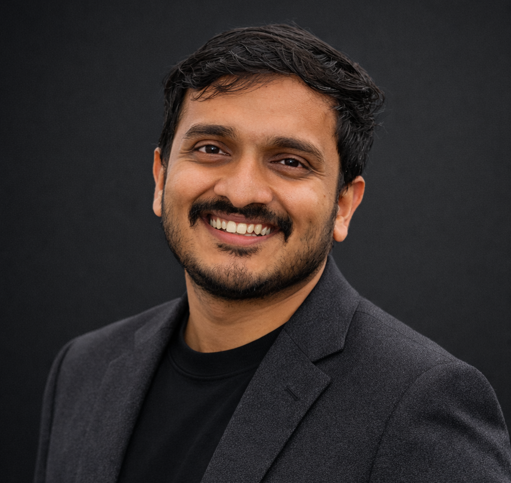

# Abhishek Odunghat – AI & Robotics Engineer

Welcome to my portfolio. I'm an electrical engineer with an M.Sc. in Smart Systems, focused on building production-grade AI systems, autonomous robotics, and intelligent automation solutions. I work at the intersection of deep learning, system integration, and real-world deployment.

---

## 👋 About Me

I design and deploy end-to-end AI solutions that work in production environments. My background spans autonomous robotics, computer vision, LLM-based agentic systems, system integration, and cloud infrastructure. I'm driven by solving real problems with clean engineering: from requirements gathering through prototyping, validation, and production deployment.

Currently based in Stuttgart, Germany. Open to roles in AI engineering, autonomy, robotics, and system integration across Europe.

---

## 🛠️ Technical Skills

### AI & Machine Learning
- **Deep Learning Frameworks:** PyTorch, TensorFlow, JAX
- **Computer Vision:** YOLO, Faster R-CNN, Detectron2, OpenCV, SAM
- **Generative AI & LLMs:** LangChain, RAG, MCP (Model Context Protocol), tool calling, prompt engineering
- **Agentic Systems:** Multi-agent orchestration, structured reasoning, decision pipelines
- **ML Ops & Deployment:** Model versioning, evaluation benchmarking, inference optimization, production monitoring

### Software Architecture & Backend
- **Backend Development:** FastAPI, Flask, REST APIs, microservices, Docker, Kubernetes
- **Databases:** PostgreSQL, MongoDB, SQL, data modeling
- **System Integration:** API design, data pipelines, ETL processes, workflow orchestration
- **DevOps & CI/CD:** GitLab CI/CD, Docker, containerization, automated testing, deployment pipelines
- **Cloud Platforms:** Azure (Fundamentals certified), AWS basics

### Robotics & Autonomous Systems
- **ROS2:** Full-stack development, Gazebo simulation, motion planning, sensor integration
- **Control Systems:** Real-time control, perception-action loops, closed-loop systems
- **Hardware Integration:** Ethernet communication, serial interfaces, sensor fusion, depth cameras (Azure Kinect)
- **Autonomous Navigation:** Path planning, collision avoidance, multi-robot coordination

### Programming Languages
- **Python:** Primary language, expert level across all domains
- **C/C++:** Systems-level work, ROS2 integration, performance-critical code
- **Bash/PowerShell:** Scripting, automation, CI/CD workflows

### Visualization & Analytics
- **Dashboards & Reporting:** SQL-based analysis, systematic performance tracking, metrics definition
- **Tools:** Matplotlib, Pandas, NumPy, SciPy

### Methodology & Process
- **Software Engineering:** Design thinking, SCRUM, agile development, code reviews, clean code principles
- **Research:** Experimental design, evaluation frameworks, scientific documentation, systematic iteration
- **Project Management:** Full-cycle ownership (requirements → prototype → production), stakeholder coordination

---

## 💼 Professional Experience

### **Porsche Engineering Services GmbH** – Stuttgart, Germany

#### Connected Car | Working Student (04/2025 – 10/2025)
- Built GitLab CI/CD-based automation workflows with scheduled processes and API-triggered runs
- Integrated REST API endpoints to trigger CI/CD pipelines and handle data exchange
- Implemented automated software rollouts across distributed test benches using Python, Bash, and Docker-based deployment
- Prototyped ESP32 microcontroller-based module for automated test-bench signal control
- **Impact:** Improved CI platform efficiency for infotainment test benches, reduced manual test execution effort

#### AI & Robotics | Intern (04/2024 – 10/2024)
- Built 2D/3D perception workflows (YOLO, Faster R-CNN) in Python to detect objects, estimate depth, and compute 3D coordinates from live camera feeds
- Owned and implemented complete computer vision workflow: data collection, labeling, model training, and deployment
- Built Python/OpenCV workflows to automatically evaluate display and hardware states by reading text, scanning QR codes, and converting to robotic actions
- Programmed and integrated a UR5 cobot to automate test and handling tasks around infotainment systems and HiL benches
- Connected robot, test PC, and measurement devices in Ethernet-based setup with full network communication configuration
- Integrated Azure Kinect tracking perception outputs into robotic automation stack using UR5 cobot
- Packaged perception components as Dockerized Python services with REST API endpoints for CI-driven test workflows
- Evaluated Keyence light-scattering vision cameras for automated object detection and pose estimation
- Supported Hardware-in-the-Loop (HiL) simulator testing and ECU functional validation
- **Impact:** End-to-end computer vision and robotics integration in production test environment; delivered working automation to engineering teams

### **Institut für Systemdynamik** – University of Stuttgart, Germany

#### Computer Vision Research | HiWi (01/2024 – 04/2024)
- Built end-to-end computer vision pipelines in Python using PyTorch and OpenCV
- Dataset creation, labeling, augmentation, model training (YOLO, SAM), and evaluation
- Implemented classical image pre-processing to improve robustness under varying lighting and viewpoints
- Deployed models as Dockerized Python service with API endpoints for integration into robotic systems
- **Outcome:** Contributed to research in perception systems for autonomous applications

### **Fichtner GmbH** – Stuttgart, Germany

#### MATLAB & Automation | Working Student (04/2023 – 12/2023)
- Prototyped Reinforcement Learning system in MATLAB to optimize battery energy storage system (BESS) charge/discharge
- Built MATLAB tool to compare renewable energy scenarios and compute KPIs with interactive dashboards
- Automated feasibility-report generation using MATLAB Report Generator (data extraction, tables, plots)
- **Focus:** Process automation and data-driven decision support for engineering analysis

### **Institute for Photovoltaics** – University of Stuttgart, Germany

#### Test Automation | HiWi (01/2023 – 03/2023)
- Developed fully automated sun-simulator testing setup in Python
- Serial control of multiplexers and precision measurement instruments to run test sequences end-to-end
- Captured IV curves and processed results automatically with systematic data export
- Built web-based Python desktop app enabling lab staff to launch tests, monitor results in real-time, and generate reports
- **Impact:** Reduced manual testing effort and enabled non-technical users to operate complex testing workflows

### **HCL Technologies Limited** – India

#### Medical Device Engineering | Member Technical Staff (09/2019 – 06/2022)
- Designed PCB schematics for medical devices in Cadence; prepared manufacturing Gerber files
- Supported medical-device documentation and MDR regulatory filing workflows
- Managed CI pipelines and release workflows in regulated engineering environment
- Resolved technical complaints within Agile teams for regulated medical devices

---

## 🎓 Education

### **Master of Science – Electrical Engineering (Smart Systems)**
**University of Stuttgart, Germany** (10/2022 – 10/2025)

**Thesis:** "LLM-based Context Recognition of Simulated Situations for Mobile Robotics in Intralogistics"
- Built complete agentic LLM stack combining LangChain, RAG, MCP server orchestration, and structured reasoning
- Trained custom computer vision models (Detectron2) for instance segmentation and object detection
- Developed closed-loop simulation environment using ROS2 and Gazebo for autonomous mobile robot tasks
- Built evaluation frameworks and SQL-based dashboards for systematic performance analysis
- Implemented multi-modal sensor data processing and structured JSON reasoning pipelines

**Relevant Coursework:**
- Detection & Pattern Recognition
- Deep Learning
- Industrial Automation Systems
- Software Engineering for Real-Time Systems
- Risk Assessment for Robotic Systems

### **Bachelor of Technology – Electrical & Electronics Engineering**
**Amrita Vishwa Vidyapeetham, India** (06/2015 – 05/2019)

**Thesis:** "Multi-agent Based Self-Healing Protection in a Smart Network"
- Designed distributed system architecture for grid protection
- Implemented multi-agent coordination algorithms

---

## 🚀 Key Projects

### **Master's Thesis: Agentic LLM for Autonomous Robots**
- **Stack:** LangChain, RAG, MCP, Detectron2, ROS2, Gazebo, PyTorch, PostgreSQL
- **Problem:** Enable autonomous mobile robots to reason about complex situations using LLMs in warehouse environments
- **Solution:** Built full perception-reasoning-action pipeline combining:
  - Detectron2-based instance segmentation for scene understanding
  - Scene graph construction from perception outputs
  - LLM-driven decision modules with tool calling and structured outputs
  - MCP server orchestration for external tool integration
- **Validation:** Closed-loop evaluation in simulation with systematic metrics tracking
- **Outcome:** Demonstrated end-to-end agentic AI system working in production-like simulation environment

### **Computer Vision End-to-End Pipeline (Porsche Engineering)**
- **Stack:** YOLO, Faster R-CNN, Detectron2, PyTorch, Azure Kinect, Python, Docker
- **Problem:** Automate test execution and object handling in infotainment test environment
- **Solution:** 
  - Built 2D/3D detection models for RGB-D data
  - Integrated depth-based 3D localization
  - Connected perception to UR5 cobot control
  - Deployed as Dockerized services with REST APIs
- **Outcome:** Working automation integrated into production test workflows; reduced manual testing effort

### **Automated Test Setup (Photovoltaics Research)**
- **Stack:** Python, serial instrument control, web interface (Streamlit/tkinter)
- **Problem:** Automate complex multi-step testing with manual data handling
- **Solution:**
  - Developed complete automation pipeline for sun-simulator testing
  - Built user-friendly desktop app for non-technical lab staff
  - Automated report generation and data export
- **Outcome:** Enabled lab staff to operate complex testing independently; eliminated manual data transcription

### **GitLab CI/CD Automation (Porsche Engineering)**
- **Stack:** GitLab CI/CD, Docker, Python, REST APIs, Bash
- **Problem:** Manual software deployment across distributed test benches was error-prone and time-consuming
- **Solution:**
  - Designed CI/CD pipelines with scheduled runs and API triggers
  - Automated software rollout with Docker containerization
  - Integrated REST API endpoints for dynamic pipeline execution
- **Outcome:** Improved deployment reliability; reduced time for software updates across test infrastructure

---

## 📊 Technical Proficiencies Summary

| Category | Skills |
|----------|--------|
| **AI/ML** | PyTorch, TensorFlow, YOLO, Faster R-CNN, Detectron2, LangChain, RAG, MCP, LLMs |
| **Backend** | FastAPI, Flask, REST APIs, Microservices, Docker, Kubernetes |
| **Robotics** | ROS2, Gazebo, UR5, Motion Planning, Multi-robot Coordination |
| **Databases** | PostgreSQL, MongoDB, SQL, Data Modeling |
| **DevOps** | GitLab CI/CD, Docker, Automated Testing, Deployment Pipelines |
| **Programming** | Python (expert), C/C++ (proficient), Bash/PowerShell, JavaScript/TypeScript |
| **Cloud** | Azure (Fundamentals certified), AWS basics |
| **Data Tools** | Pandas, NumPy, SciPy, Matplotlib |
| **Visualization** | Dashboards, SQL-based analytics, Performance metrics |

---

## 🌐 Languages

- **English:** Professional/Advanced (C1) – 
- **German:** Basic/Working (B1)
- **Hindi:** Advanced (C1) 
- **Malayalam:** Mother Tongue

---

## 📚 Publications

**IEEE i-PACT 2019:** "Fault Detection Isolation Restoration of an Active Distribution Network"  
*O. Abhishek et al.* | DOI: 10.1109/i-PACT44901.2019.8960245

---

## 🔗 Connect With Me

- **Email:** [odunghat.abhi@gmail.com](mailto:odunghat.abhi@gmail.com)
- **LinkedIn:** [linkedin.com/in/abhisheko](https://linkedin.com/in/abhisheko)
- **Phone:** +49 176 67474907
- **Location:** Stuttgart, Germany

---

## 📝 Note

This portfolio reflects real projects, real experiences, and real impact. Every technical skill mentioned here has been applied in production or research settings. I believe in shipping working solutions, writing clean code, and maintaining the highest standards of engineering discipline.

Feel free to reach out to discuss how I can contribute to your team or project.

---

*Last updated: June 2026*
